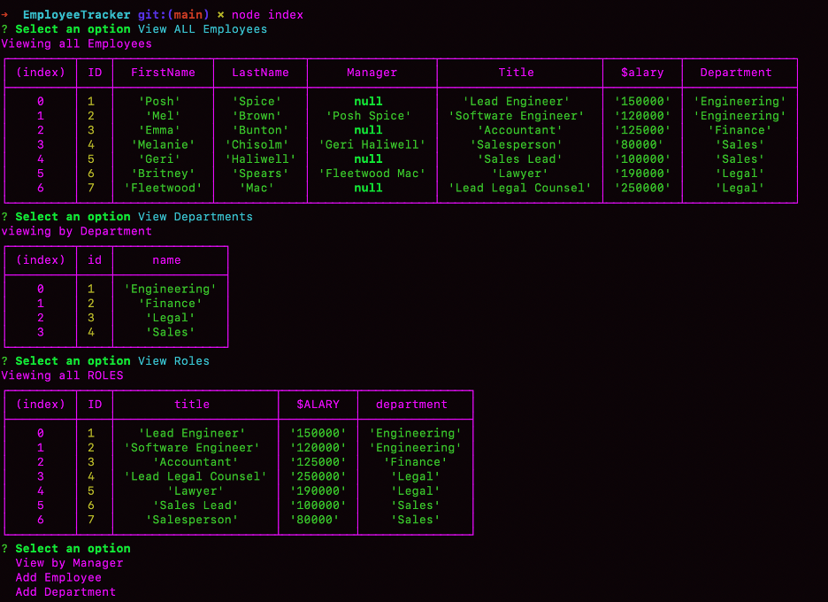

# EmployeeTracker

## Description 
Keep track of your employees through back end databases through the use of MySQL and Node.js inquirer. You can see a list of all the Employees, their title, Roles, Salary, Department and Manager. 

## Table of Contents 
* [Installation](#installation)
* [Usage](#usage)
* [Credits](#credits)
* [License](#license)

## Installation 
Install MySQL and Node Inquirer through the command line termainal. Type in "npm install --save mysql2" to install MySQL2 to your terminal. Then type "npm init -y" to install node.js. Then type "npm i inquirer" to install the inquirer node package. 

## Usage 
Once in the root directory after git cloning the repo, open terminal and type "mysql -u root -p" to open the mysql terminal line, then add your database by typing "CREATE DATABASE business" and then type "USE business". Then type "source db/schema.sql" and "source db/seeds.sql". To verify tables were created you can type "SHOW TABLES" then follow mysql prompts to open a table such as "SELECT * FROM employee;". Then type "quit" to go back to root command line and then to start prompts type "node index" or "node index.js" and follow the prompts. 

## Video Link showing app in use:

    
## Credits 
UofA Coding Bootcamp

## License 
MySQL, mysqlite3, Node.js, Node Inquirer 

## Contributing 
To contribute, look in the Github repo for any open issues that describe how to contribute if needed.

